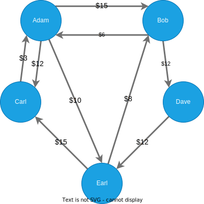

# min-flow

### Description

Algorithm that takes in a directed graph of n nodes, where the edges are how much one node "owes" to another. The algorithm prunes the graph until there are the minimum number of transactions such that every node gets the amount they are "owed".

The most common application for this script is when a group of people owe eachother money. Take the example below:



The script will reduce the number of transcations, such that everyone gets the amount of money that they are owed:


This assumes that the currency is universal.

### How to run

After cloning the repo, you can run the script by simply running `main.py`
```
python main.py
```
The program will prompt you for an input csv file. An example of the format of the csv is given in `input.csv`:

```
Adam,Bob,15
Bob,Adam,6
Adam,Carl,12
Carl,Adam,3
Bob,Dave,12
Adam,Earl,10
Earl,Bob,8
Earl,Carl,15
Dave,Earl,12
```
